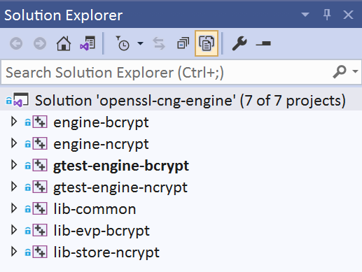
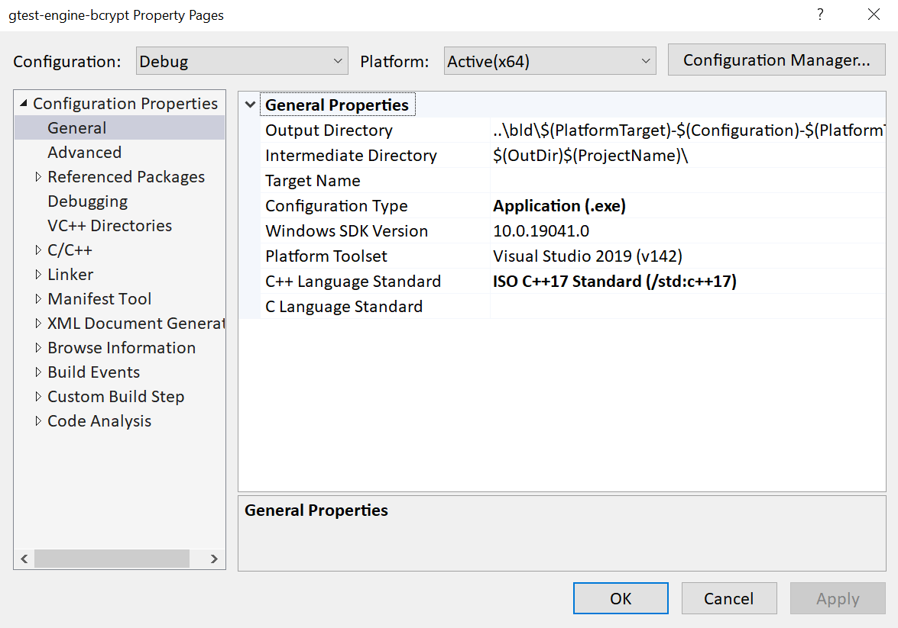
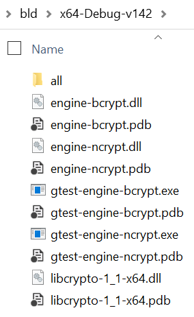

.. _building_projects_rst:

MSBuild projects
================

The solution file as described in section :ref:`building_solutions_rst` contains not much more than the definitions of the different build configurations and references to a number of MSBuild projects, found in the ``msbuild`` directory. These are the projects that are visible in the IDE:

|solution_explorer|

The IDE provides mechanisms to edit the project files, via the elements in their property pages. However, there are quite a few MSBuild features that are not exposed in that way. Examples of missing constructs are conditional and/or custom property definitions, which are heavily used in the CNG Engine solution. Therefore editing properties in the IDE is not recommended or even possible for this solution. Instead, the XML project files have to be edited directly. For those interested, the `MSBuild page in the Visual Studio documentation <https://docs.microsoft.com/en-us/visualstudio/msbuild/msbuild>`_ provides an excellent introduction and exhaustive reference.

Each of the projects is explained in more detail below in :ref:`projects_overview`. They all include common configuration settings, as described in :ref:`projects_shared`. Finally, :ref:`projects_output` documents the output locations used by each of them.

.. _projects_overview:

Projects overview
-----------------

The solution contains several projects of different types. Their main purpose is to identify the type of element (static or dynamic library, or application) and which source code files need to be compiled and linked with it. This section only gives short descriptions. Instructions on how to run the test applications and how to use the engine libraries are given in :ref:`testing_rst` and :ref:`using_rst`.

Naming conventions are for static libraries to start with ``lib-``, dynamic (run-time loadable) libraries to start with ``engine-`` and test applications to start with ``gtest-``. The libraries are written in C, the test applications in C++.

``lib-common``
**************

This static library implements common functionality that is used by both the EVP and STORE components of the engine. Examples are debugging, tracingand error message mechanisms.

``lib-evp-bcrypt``
******************

This static library is the actual engine that implements the EVP methods as outlined in section :ref:`algorithms_rst`. It is responsible for conversions back and forth between OpenSSL structures and their equivalent BCrypt counterparts. It knows how to forward the different ``evp`` calls to the right functions of the ``bcrypt`` API. It has the ``lib-common`` library as a dependency.

This is your library of choice when using the BCrypt EVP engine in the statically linked mode. See the ``gtest-engine-bcrypt`` project for an example on how to link and use it. 

``engine-bcrypt``
*****************

This dynamic library is the actual artefact that can get dynamically loaded, at runtime, by the OpenSSL suite as an engine, to replace its built-in algorithms. It is a small element that initializes the engine and relies on the ``lib-evp-bcrypt`` library beyond that.

``gtest-engine-bcrypt``
***********************

This application, based on the Google Test framework, implements a set of tests to verify the EVP functionality as provided by the ``engine_bcrypt`` library. It dynamically loads (and unloads) that engine, executes algorithms with different input values and compares the output with expected results. When run in debug configuration, additional checks around memory usage (un-freed pointers, heap corruption, stack corruption) are done.

This project depends on several Google Test components, as identified in ``msbuild\packages.config`` NuGet configuration file. In some cases, Visual Studio and/or MSBuild will not automatically install all dependencies properly, resulting in an error message. It may be required to install the missing packages manually using the NuGet CLI or the Visual Studio NuGet Package Manager features.

By default, this test has the BCrypt EVP library statically linked. To switch to dynamic loading, define the preprocessor symbol ``DO_BCRYPT_EVP_DYNAMIC`` at compile time and give it a value other than 0.

``lib-store-ncrypt``
********************

This static library is the actual engine that implements the STORE methods as outlined in section :ref:`store_rst`. It is responsible for conversions back and forth between OpenSSL structures and their equivalent NCrypt counterparts. It knows how to forward the different ``evp`` calls to the right functions of the ``ncrypt`` API. It has the ``lib-common`` library as a dependency.

This is your library of choice when using the NCrypt Store engine in the statically linked mode. See the ``gtest-engine-ncrypt`` project for an example on how to link and use it. 

``engine-ncrypt``
*****************

This dynamic library is the actual artefact that can get dynamically loaded, at runtime, by the OpenSSL suite as an engine, as a store provider for the CNG ``cert:`` URI scheme. It is a small element that initializes the engine and relies on the ``lib-store-ncrypt`` library beyond that.

``gtest-engine-ncrypt``
***********************

This application, based on the Google Test framework, implements a set of tests to verify the STORE functionality as provided by the ``engine_ncrypt`` library. It dynamically loads (and unloads) that engine, iterates over certificates and keys found in the certificate store and executes signing of messages as well as verification of signatures and certificates. When run in debug configuration, additional checks around memory usage (un-freed pointers, heap corruption, stack corruption) are done.

This project depends on several Google Test components, as identified in ``msbuild\packages.config`` NuGet configuration file. In some cases, Visual Studio and/or MSBuild will not automatically install all dependencies properly, resulting in an error message. It may be required to install the missing packages manually using the NuGet CLI or the Visual Studio NuGet Package Manager features.

By default, this test has the NCrypt STORE library statically linked. To switch to dynamic loading, define the preprocessor symbol ``DO_NCRYPT_STORE_DYNAMIC`` at compile time and give it a value other than 0.

.. _projects_shared:

Shared configuration
--------------------

All projects mentioned above have certain settings in common. This is reflected by the fact that they all import the same MSBuild files called ``import-pre``, near the beginning of each project file, and ``import-post``, near the end. Both are located in the ``msbuild`` directory.

The MSBuild documentation sometimes refer to such imported configuration files as `property files`, which is why their filenames are chosen to end with ``.props`` for this project. However, their contents in this case do not show up in the IDE's property manager window, due to the aforementioned limited implementation of MSBuild constructs in Visual Studio. As such, these actual property files are largely invisible, unless opened directly from the file system. Their resulting configuration settings do show up in the property pages though, as shown in this example:

|general_properties|

Property values showing up in **bold** are set in the main project file. Property values showing up in regular font are set in one of the import files. Empty property values indicate Visual Studio default values.

``import-pre``
**************

This property file contains logic for selecting the Windows SDK version. If no specific version is requested (via one of the non-default solutions whose name ends with the desired SDK version number), it will query the registry to find the latest installed SDK. To observe the selected SDK in the Visual Studio IDE, see the *Windows SDK Version* field in the *General Properties* section of the property pages of the project.

Other settings configured in the import file are common compiler and linker settings, some common preprocessor directives, the include and library paths for OpenSSL and the build output directories. The latter is explained in the section below.

``import-post``
***************

This property file defines some MSBuild tasks that take care of copying the built applications and engines as well as the required OpenSSL crypto library to a convenient location, as explained in the section below.

.. _projects_output:

Output files and locations
--------------------------

All projects are configured to put their output in a directory whose name depends on several variables:
``bld\$(PlatformTarget)-$(Configuration)-$(PlatformToolset)$(SDKSuffix)\all``. The ``SDKSuffix`` is optional. Furthermore, each project uses its own subdirectory below that, with the same name as the project itself, to place its intermediate build objects.

The binaries that contain the actual engines are called ``engine-bcrypt.dll`` and ``engine-ncrypt.dll`` for the dynamic versions, and ``lib-evp-bcrypt.lib`` and ``lib-store-ncrypt.lib`` for their static counterparts.

For convenience, the small subset of binaries relevant for use with the ``openssl`` tool and for running and -- in the case of a debug build -- debugging the test applications are additionally copied to one directory level up higher. This is illustrated in the following screen shot:

|output|

