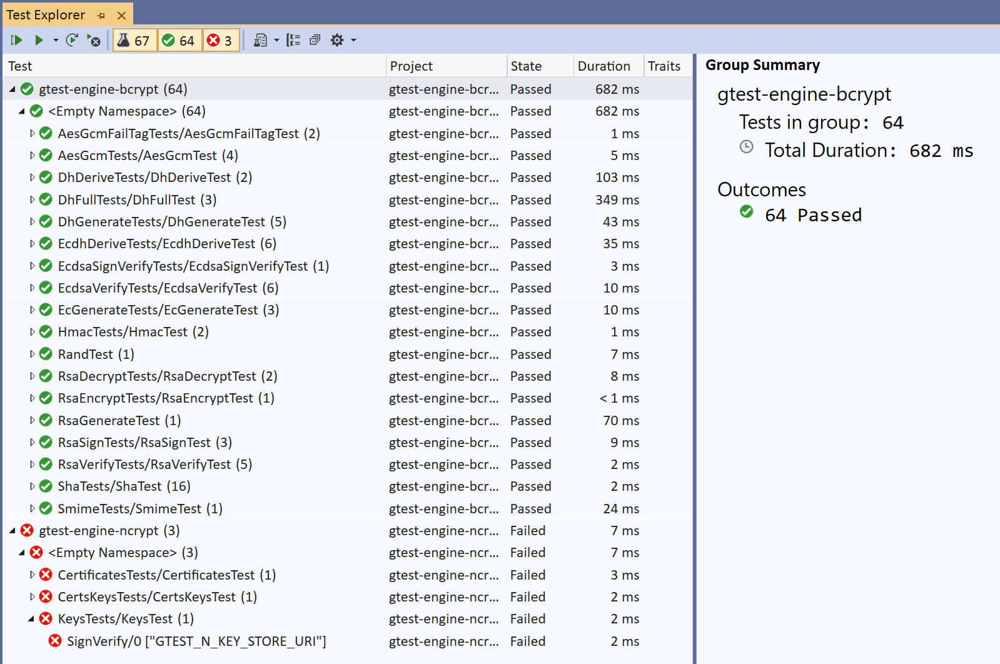
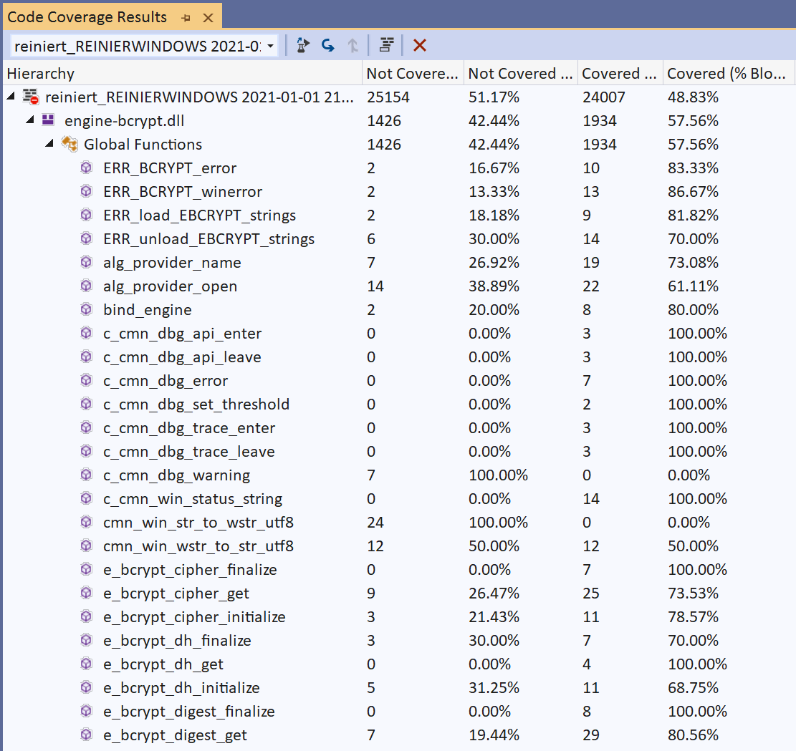
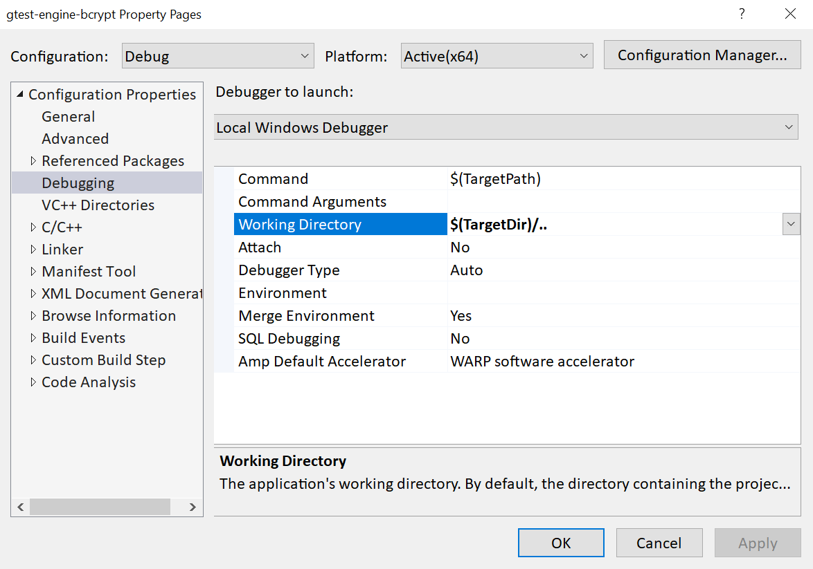

.. _testing_visual_studio_rst:

Running tests with Visual Studio
================================

The Visual Studio IDE adds value by providing specialized windows for running and analyzing tests. Additionally, it is capable of displaying debug output emitted by the CNG Engine components.

Test Explorer
-------------

The Test Explorer is a window that can be opened via the Test → Test Explorer menu item. It is a visual interface into the functional test results, provided by the GoogleTest framework in conjunction with the Google Test Adapter. It is also capable of starting (and interrupting) any (collection of) defined test cases.

|testing_explorer|

Code Coverage
-------------

The Enterprise edition of Visual Studio is capable of determining code coverage as well, via the Test → Analyze Code Coverage for All Tests menu item. 

|testing_coverage|

Note that the code coverage percentage is currently low due to the large amount of failure branches that have not been hit.

Running in the VS debugger
--------------------------

The functional tests can easily be run in the Visual Studio debugger as well. This requires changing the Working Directory configuration in the Debugging property page to ``$(TargetDir)/..``, like this:

|testing_properties|

When running in the VS Debugger, debug messages may be emitted and show up in the Output window, for example like this:

.. code-block:: none

    error: Win API: BCryptVerifySignature failed (0xc000a000, "The cryptographic signature is invalid."): Verifying signature with RSA key

These are (double-)clickable messages that allow for navigating to the associated source code line. For more information on debug messages, see section :ref:`using_debugging_rst`.

