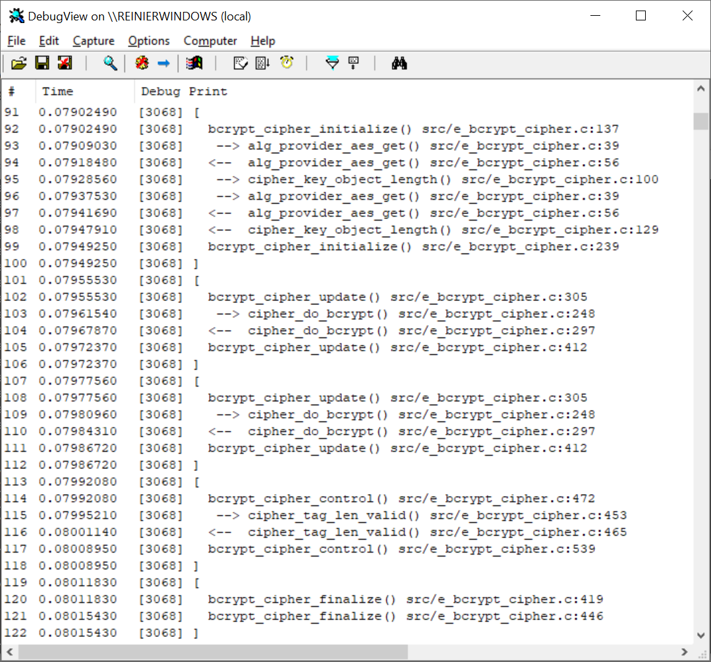
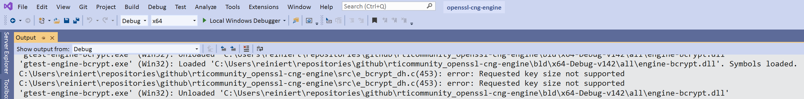

.. _using_debugging_rst:

Debugging
=========

Both the BCrypt and NCrypt engines are capable of emitting debug messages, if built in debug mode.

Debug levels
------------

As explained in section :ref:`using_engine_commands_rst`, the debug level can be set via the engine control command ``BCRYPT_CMD_DBG_LEVEL``, or via its string representation ``"debug_level"``. Higher numbers indicate larger amounts of debug message traffic.

The most severe messages indicate errors, they are emitted at level 0. Those include the entire path of where the error occurred. The full contents of the examples briefly mentioned in section :ref:`using_errors_rst` look like this:

.. code-block:: none

    [14828] C:\Users\reiniert\repositories\github\rticommunity_openssl-cng-engine\src\e_bcrypt_cipher.c(329): error: Can not invoke Update() before Init() or after Final() 
    [12176] C:\Users\reiniert\repositories\github\rticommunity_openssl-cng-engine\src\e_bcrypt_cipher.c(289): error: Win API: BCryptDecrypt failed (0xc000a002, "The computed authentication tag did not match the input authentication tag."): Decrypting with AES-GCM 
    [12108] C:\Users\reiniert\repositories\github\rticommunity_openssl-cng-engine\src\e_bcrypt_ec.c(1010): error: OpenSSL API: d2i_ECDSA_SIG failed: Verifying signed digest 

Level 1 is for warnings. Level 2 is for tracing of API method invocations, meaning those methods that are part of the Engine interface. The highest level is 3, indicating full tracing of all functions. 

Capturing debug messages
------------------------

All debug messages are written using the `OutputDebugString <https://docs.microsoft.com/en-us/windows/win32/api/debugapi/nf-debugapi-outputdebugstringw>`_ Windows API function. These are only visible if some process has attached itself to the debug messaging infrastructure. For this purpose, the SysInternals application `DebugView <https://docs.microsoft.com/en-us/sysinternals/downloads/debugview>`_ can be used, for example. Tracing messages in that tool will look like this:

|debugview|

Note that the GoogleTest applications use the same mechanism and may therefore its messages may show up within the same display. Other running processes could do the same.

Debugging in Visual Studio
--------------------------

Visual Studio itself is capable of acting as a debugger. It will capture debug messages as well and display them in the Output window. The items are clickable and clicking them will navigate to the indicated location. For example right-clicking on the ``gtest-engine-bcrypt`` project and selecting the context menu item ``Debug ▶︎ Start New Instance`` will yield these lines with error messages, among others:

|vs_output|

Note that the debug messages will no longer show up in any running DebugView process when running in the Visual Studio IDE.

Mixing debug and non-debug libraries
------------------------------------

Be careful when using non-debug OpenSSL libraries in combination with debug Engines. Although this is a tested scenario, unexpected issues may occur. In particular, memory management functions need to be used consistently. This can be achieved using the ``CRYPTO_set_mem_functions`` function, as illustrated in both ``test_bcrypt.cpp`` and ``test_ncrypt.cpp``.

