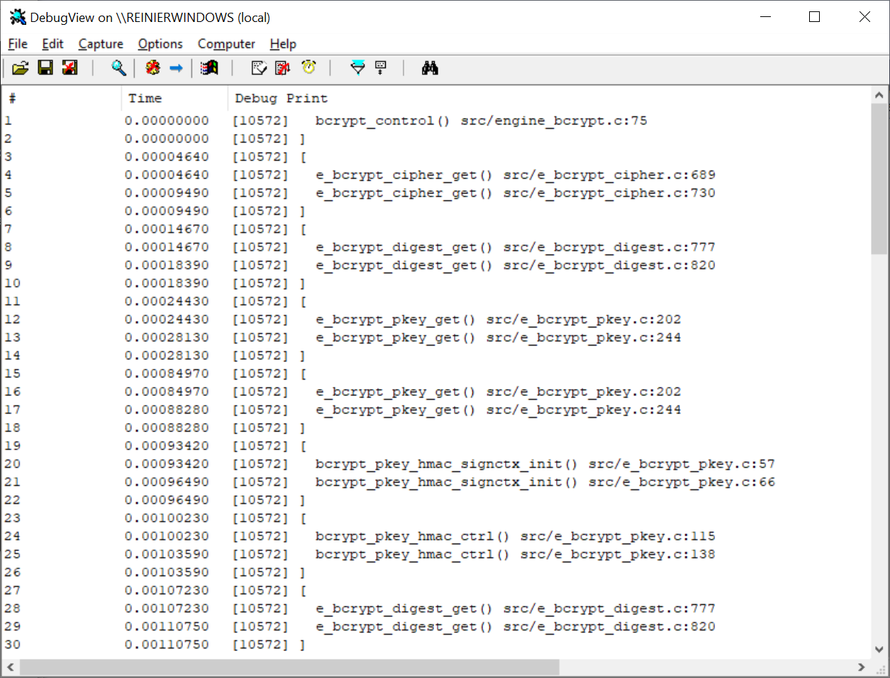
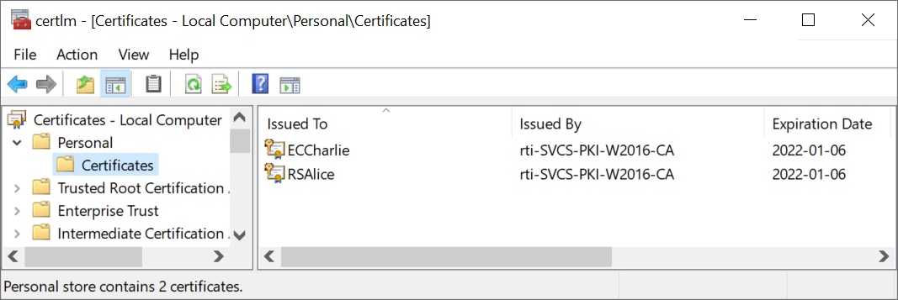
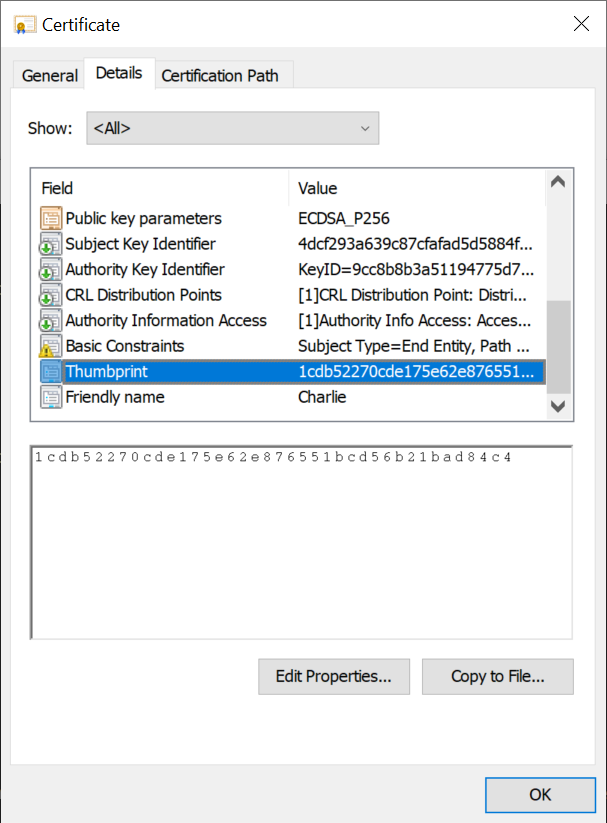

.. _using_openssl_commands_rst:

OpenSSL commands with the engine(s)
===================================

Many of the `OpenSSL commands <https://www.openssl.org/docs/man1.1.1/man1/>`_ have the option to load and use engines. This section explains the supported mechanisms and shows some examples using each of them for both the BCrypt EVP engine and the NCrypt store engine. To run them, make sure that ``openssl`` and its libraries can be found by OpenSSL, as explained in :ref:`using_dynamic_loading_rst`. This set of examples is not exhaustive; for more details, see the OpenSSL documentation for the different commands.

For the sake of simplicity, the examples in this section are limited to the ``dgst`` command, which is versatile enough to demonstrate the basics. It can be used with both the BCrypt EVP and NCrypt STORE engines.

BCrypt EVP engine example commands
----------------------------------

This section shows how to use the BCrypt EVP engine in the following command, which uses the OpenSSL built-in implementation:

.. code-block:: none

    > echo To be signed| openssl dgst -hmac someKey
    (stdin)= 66498048b38624a9c6d2431873b124981f77ed5bd0ebcacecbcbe8e81ce6d091

This can be reproduced using the CNG implementation of the crypto algorithms through the BCrypt EVP engine as follows:

.. code-block:: none

    > echo To be signed| openssl dgst -hmac someKey -engine engine-bcrypt
    engine "engine-bcrypt" set.
    (stdin)= 66498048b38624a9c6d2431873b124981f77ed5bd0ebcacecbcbe8e81ce6d091

For this to work, ``engine-bcrypt.dll`` should be locatable by OpenSSL via the means explained above.

Although the tool logs that the desired engine is set, it does not prove convincingly that the engine is actually used. For this, the debug version of the engine can help. Setting its verbosity level to 2 will enable tracing. The OpenSSL tools have no command line option for doing that, so an example OpenSSL configuration file is used to achieve this. Assume that ``bcrypt.conf`` is in the current directory, with the following contents:

.. code-block:: none

    # This is bcrypt.conf
    openssl_conf = openssl_init

    [openssl_init]
    engines = engine_section

    [engine_section]
    bcrypt = bcrypt_section

    [bcrypt_section]
    dynamic_path = engine-bcrypt
    init = 1
    debug_level = 2
    default_algorithms = ALL

Now the following will leverage the engine:

.. code-block:: none

    > set OPENSSL_CONF=bcrypt.conf
    > echo To be signed| openssl dgst -hmac someKey
    (stdin)= 66498048b38624a9c6d2431873b124981f77ed5bd0ebcacecbcbe8e81ce6d091

Running ``DebugView`` at the same time demonstrates that the BCrypt EVP engine was used indeed:

|bcrypt_debugview|

NCrypt STORE engine example commands
------------------------------------

By leveraging the NCrypt STORE engine, the OpenSSL ``storeutl`` command can be used to list the contents of the Windows certificate store. The example commands below are applied to the personal certificates in the following local computer store:

|personal_certificates|

As explained in :ref:`store_objects_uris_rst`, the associated URI is ``cert:/LocalMachine/My``. Its contents can be queried like this:

.. code-block:: none

    > openssl storeutl -engine engine-ncrypt -certs cert:/LocalMachine/My
    engine "engine-ncrypt" set.
    0: Name: cert:/LocalMachine/My/9b85e433216f91999362fe38d8729ee74a098950
    CN=RSAlice
    1: Name: cert:/LocalMachine/My/1cdb52270cde175e62e876551bcd56b21bad84c4
    CN=ECCharlie
    Total found: 2

Since OpenSSL itself does not support the ``cert:`` URI schema, there is no need to prove that ``engine-ncrypt`` is used -- this command would fail if it wasn't.

The long numbers in the printed certificate URIs are the certificates' thumbprints, as can be illustrated by inspecting the certificate details of ECCharlie:

|charlie_thumbprint|

Using the private key associated with that certificate, some example plaintext can be signed. In this command, the same URI is used to indicate the private key:

.. code-block:: none

    > echo To be signed| openssl dgst -sha256 -keyform engine -engine engine-ncrypt -sign cert:/LocalMachine/My/1cdb52270cde175e62e876551bcd56b21bad84c4 -out signature.bin

Note that this requires Administrator privileges, since it uses the private key associated with a certificate in the local computer's store.

For illustrative purposes, the NCrypt-generated signature will be verified using the built-in OpenSSL algorithms. This is possible because the public key is, like the name indicates, publicly available and verification therefore does not require the use of the NCrypt engine. The first step is to grab the public key from the same certificate, which can be done in a one-liner like this (which does not require Admin privileges):

.. code-block:: none

    > openssl storeutl -engine engine-ncrypt -certs cert:/LocalMachine/My/1cdb52270cde175e62e876551bcd56b21bad84c4 | openssl x509 -pubkey -noout > ECCharlie_pub.pem

With that, the signature previously generated can be verified with the builtin OpenSSL implementation like this:

.. code-block:: none

    > echo To be signed| openssl dgst -signature signature.bin -verify ECCharlie_pub.pem
    Verified OK

